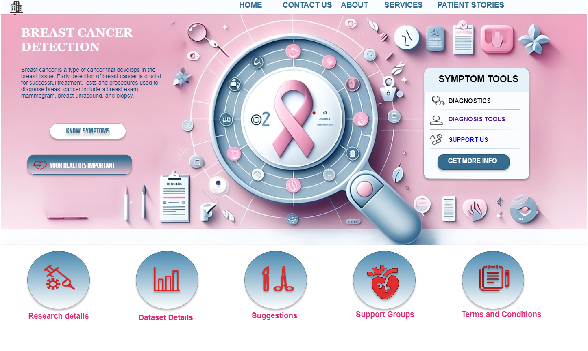
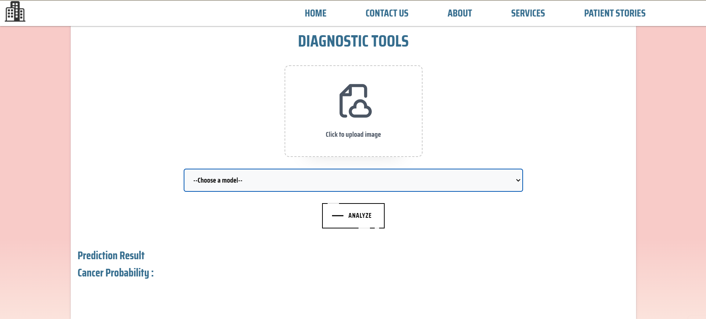
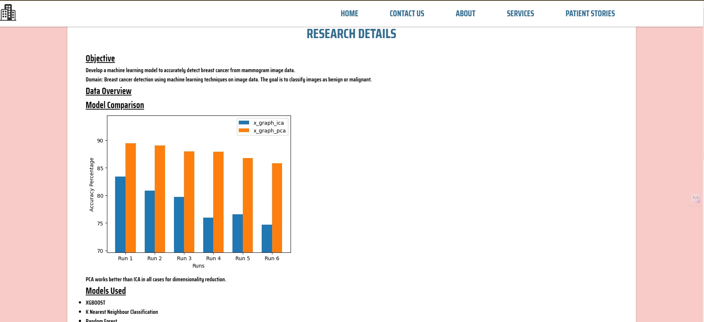

# RadiantCancerDetect
RadiantCancerDetect uses machine learning to detect breast cancer from mammograms. Our web interface simplifies analysis for medical professionals, aiding in early detection and improved patient outcomes.

## Features
- Detects breast cancer from mammogram images.
- Provides accurate predictions based on machine learning models.
- User-friendly interface for easy interaction.

- ## Screenshots





## Installation

Install my-project with npm

1. Clone the repository:
```bash
git clone https://github.com/Vinu-1975/RadiantCancerDetect.git
```
2. Navigate to the project directory:
```bash
cd RadiantCancerDetect
```
3. Setup & Activate the virtual environment (if using):
```bash
python3 -m venv env
source env/bin/activate  # for Unix/Linux
env\Scripts\activate    # for Windows
```
4. Install dependencies:
```bash
pip install -r requirements.txt
```
5. Run all the files inside `model_trainers` directory

6. Run `app.py`

## Models Used
The following machine learning models were utilized in this project for breast cancer detection:

- XGBoost
- K Nearest Neighbour Classification
- Random Forest
- Logistic Regression
- Decision Tree
- Convolutional Neural Network
- Naïve Bayes
- Hierarchical Clustering

*Please note that only a subset of these models is available in the webpage interface for interactive testing:* **[KNN, RandomForest, Logistic Regression, XGBoost]**

## Presentation
A PowerPoint presentation containing detailed information about the project has been uploaded. You can find it [here](https://github.com/Vinu-1975/RadiantCancerDetect/blob/main/ProjectDetails.pptx).


